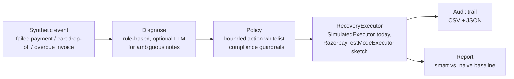

# Recoup — an AI Revenue Recovery agent

Built for Razorpay's Buildathon, **Track 03: AI Revenue Recovery**.

Recoup looks at a batch of at-risk revenue events — failed payments, abandoned
checkouts, overdue invoices — diagnoses *why* the money is stuck, picks one
action from a fixed, compliance-bounded whitelist, and reports exactly how
much it recovered, what it cost to recover it, and every guardrail that
fired along the way.

## The track's bar, and where it's met

> "Don't just identify the problem. Show measured money recovered across a
> batch, with compliant escalation, stopping rules, and an audit trail."

| Requirement | Where |
|---|---|
| Measured money recovered across a batch | [`recoup/report.py`](recoup/report.py) — compares the agent against a naive baseline on the same batch, not just a single cherry-picked case |
| Compliant escalation | [`recoup/policy.py`](recoup/policy.py) — disputed invoices and high-value cases (`> ₹50,000`) always route to a human, never automated |
| Stopping rules | same file — retry caps, backoff windows, promise-to-pay honoring, 90-day write-off ceiling, DND hours, a low-value outreach floor |
| Audit trail | [`recoup/audit.py`](recoup/audit.py) — every decision, its reasoning, every guardrail evaluated, and the outcome, exported to CSV + JSON |

## How it works



The LLM (optional, off by default) is only ever allowed to (a) classify an
ambiguous free-text note into one of a fixed set of root causes, and (b)
draft the customer-facing message text for an action the policy already
chose. It never picks the action. The policy engine is plain deterministic
Python so every guardrail can be — and is — unit tested independent of any
model call.

The step after "decide" is behind a `RecoveryExecutor` interface
([`recoup/simulate.py`](recoup/simulate.py)), not a bare function — see
["Architecture: the executor seam"](#architecture-the-executor-seam) below
for why that's the one abstraction this build deliberately adds.

## Quickstart

Requires Python 3.10+. No third-party packages needed for the default path.

```bash
git clone <this-repo-url> recoup
cd recoup
python -m recoup.run
```

Then open `out/report.html` in a browser. It also writes
`out/audit_trail.csv` and `out/audit_trail.json`.

Useful flags:

```bash
python -m recoup.run --events 500 --seed 7   # bigger batch, different seed
python -m recoup.run --use-llm               # see "Optional LLM mode" below
```

Two more entry points, covered in their own sections below:

```bash
python -m recoup.evaluate   # smart vs. baseline, averaged over 100 batches, not just one
python -m recoup.trace      # watch one ambiguous event go through diagnosis -> policy -> outcome
```

## What the numbers mean

Every batch is run twice on the *same* events, sharing the *same* random
draws: once through Recoup's diagnosis-driven policy, once through a naive
baseline that always applies one fixed action per category (e.g. always
`retry_now` on a failed payment) regardless of root cause. Both runs obey
identical guardrails — the baseline is naive about *which action to pick*,
not about compliance. The report's headline number is the gap between
them: how much diagnosis-driven targeting actually recovers over "just
retry/remind everything."

"Sharing the same random draws" is worth being explicit about: each event
gets one random number (`u`), generated once, and *both* policies are
scored against that same `u` when they simulate an outcome (see
[`recoup/simulate.py`](recoup/simulate.py)). That's a "common random
numbers" comparison — if smart and baseline happen to pick the same action
for an event, they get the identical outcome; if they pick different
actions, the only thing that can explain a different result is the action,
not one run getting luckier draws than the other.
[`tests/test_end_to_end.py`](tests/test_end_to_end.py) checks this
property directly.

The event batch and both policy runs are deterministic given `--seed`, so
the same command reproduces the same report every time — but one seed is
still one sample. See `python -m recoup.evaluate` below for the
many-batches version of this same comparison.

## Multi-batch evaluation

One seed is one sample — even an honest one can look cherry-picked. `python
-m recoup.run` reports a single batch; `python -m recoup.evaluate` runs the
*same* smart-vs-baseline comparison over many independent batches and
averages it:

```bash
python -m recoup.evaluate
# Ran 100 batches x 500 events (50,000 events total)
#
# Smart average recovery rate:    14.3%  (min 9.7%, max 20.3%)
# Naive average recovery rate:     6.4%  (min 4.3%, max 9.3%)
#
# Incremental recovery:          +8.0 percentage points
# Smart beat naive in 100/100 batches (100%)
```

That last line is the one that matters most: it's not just that the
*average* is better, it's that diagnosis-driven targeting won on every
single one of 100 independently-generated batches. Runs in about two
seconds on 50,000 events, with `--batches` and `--events-per-batch` to
adjust the sample size.

## Seeing the AI step

The aggregate numbers above don't make it obvious that an LLM is actually
in the loop anywhere. `python -m recoup.trace` runs one illustrative,
ambiguous event through the full pipeline and prints every stage:

```bash
python -m recoup.trace --use-llm
# Event: failed UPI payment, Rs. 2,499
# Note:  "I've tried paying twice but UPI keeps failing."
#   |
#   v
# Claude
#   -> root_cause: upi_mandate_failed
#   -> confidence: 0.91
#   -> rationale:  ...
#   |
#   v
# Policy
#   -> guardrail 'dispute_routing': passed
#   -> guardrail 'high_value_threshold': passed
#   -> guardrail 'dnd_hours': passed
#   -> action: send_update_payment_link
#   |
#   v
# Simulated outcome
#   -> recovered: True
#   -> amount:    Rs. 2,499
```

Without `--use-llm` (or without a key), the same trace runs against the
rule engine instead, and says so explicitly — it never silently pretends
the LLM classified something it didn't.

## Guardrails / stopping rules

| Guardrail | Rule |
|---|---|
| `dispute_routing` | A disputed invoice never gets an automated action — always a human |
| `high_value_threshold` | Any event over ₹50,000 escalates to a human instead of running autonomously |
| `promise_to_pay` | If a customer already promised a payment date, no contact until it passes |
| `max_overdue_days` | Invoices over 90 days overdue are written off, not chased indefinitely |
| `max_retry_cap` | Failed payments stop auto-retrying after 3 attempts (escalate, or give up if the amount is small) |
| `retry_backoff_window` | Retries wait 1h / 6h / 24h between attempts — no hammering |
| `contact_frequency_cap` | At most one contact per customer per 24h |
| `dnd_hours` | No outbound messages between 9pm and 9am |
| `low_value_floor` | Abandoned carts under ₹300 get no automated outreach — not worth the cost |
| `discount_ceiling` | Any discount offered in a recovery message is capped at 10% |

All of these are unit-tested in [`tests/test_policy.py`](tests/test_policy.py) —
each one holds regardless of what the diagnosis says, and regardless of
whether the run is in "smart" or "naive baseline" mode.

## Optional: real Claude-assisted diagnosis

By default, everything runs on deterministic rules — no API key, no
network call, no cost. To let Claude help classify the ~15% of failed
payments that only have a free-text note instead of a structured decline
code (and to draft the outreach copy):

```bash
pip install -r requirements-llm.txt
export ANTHROPIC_API_KEY=sk-...      # Windows PowerShell: $env:ANTHROPIC_API_KEY = "sk-..."
python -m recoup.run --use-llm
```

If the key is missing, the package isn't installed, or the call fails for
any reason (network, rate limit, malformed response, or an answer outside
the allowed root causes), Recoup silently falls back to the rule-based
path. A batch run should never crash because an optional model call failed.

## Tests

```bash
python -m pytest
```

(Run as `python -m pytest`, not bare `pytest`, so the `recoup` package is
importable without a separate install step.)

## Architecture: the executor seam

Everything from "diagnose" through "decide" produces a plain `Decision` —
an action, chosen from the whitelist, with guardrails already checked.
What happens *with* that decision is behind one interface:

```python
class RecoveryExecutor(ABC):
    def execute(self, event, root_cause, action, u) -> Outcome: ...
```

`SimulatedExecutor` ([`recoup/simulate.py`](recoup/simulate.py)) is the
only implementation that actually runs in this build — no accounts, no
network calls, a fixed diagnosis-aware probability table standing in for
a real outcome. `RazorpayTestModeExecutor`
([`recoup/razorpay_adapter.py`](recoup/razorpay_adapter.py)) is a second,
*intentionally unimplemented* one: it shows exactly which four action
groups would need a real API call (payment retry, payment links,
notifications, human handoff) and raises `NotImplementedError` on each,
rather than faking a Razorpay integration that was never actually tested
against a real account. Swapping executors doesn't touch `diagnose.py`,
`policy.py`, `audit.py`, or `report.py` at all — that's the point of
drawing the line here instead of anywhere else.

This is the one abstraction the codebase adds beyond what today's
synthetic-data scope strictly needs, and it's added for a specific
reason: it's the seam a real integration would actually plug into, made
concrete instead of asserted.

## What's simulated, and what's real

This build intentionally uses **synthetic data only** — no Razorpay account
or API keys are required to run it. Being upfront about that:

- Events (failed payments, abandoned checkouts, overdue invoices) are
  generated, not pulled from a live merchant.
- "Sending" a reminder or retrying a payment is simulated: each action has
  a fixed, diagnosis-aware probability of recovering the money (see
  `recoup/simulate.py`), not a real gateway or messaging call.
- The point of the build is the *decision loop* — diagnose, choose a
  bounded action, respect guardrails, measure the result against a
  baseline — which is the same loop a production version would run, just
  with `SimulatedExecutor` swapped for a real `RecoveryExecutor`
  implementation (see "Architecture: the executor seam" above).


## Project layout

```
recoup/
  models.py            # Event, Diagnosis, Decision, Outcome, AuditRecord
  data_gen.py           # deterministic synthetic batch generator
  diagnose.py           # rule-based root-cause diagnosis (+ optional LLM hook)
  llm.py                # optional Claude integration, always with a safe fallback
  policy.py             # the bounded, gated, tested decision engine
  simulate.py           # RecoveryExecutor interface + SimulatedExecutor
  razorpay_adapter.py   # RazorpayTestModeExecutor - documented stub, not wired up
  audit.py              # CSV/JSON audit trail export
  report.py             # metrics + self-contained HTML report
  run.py                # CLI entrypoint - one batch, smart vs. baseline
  evaluate.py           # CLI entrypoint - many batches, averaged
  trace.py              # CLI entrypoint - one event, every pipeline stage printed
tests/                  # guardrail, diagnosis, executor, and end-to-end tests
```
